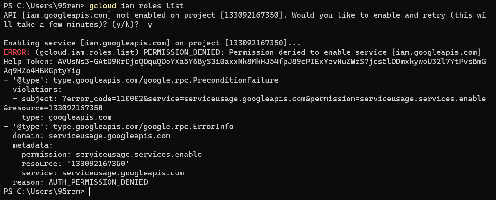

### Day1
---
## Lab 1.1

- Q5

    

- Q6

    

- Q7
  
    
    

- Q8
  
    

- Q9
  
    
    

---

## Lab 1.2

- Q1
  
    
    

- Q2
  
    

- Q3
  
    

- Q4
  
    
    

- Q5

    - I )
  
        

    - II )
  
        
    
    - III )
  
        
    
    - IV )
  
        

    - V )
  
        

    - VI )
  
        

    - VII ) It needs an extra permision 
  
        
    
    - VIII ) It needs an extra permision 
  
        

