# Day3 
## Lab 3.1

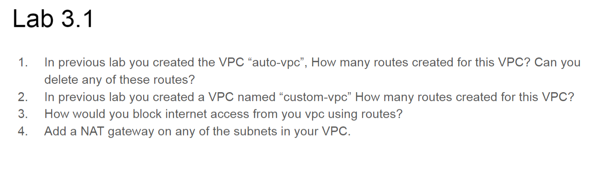

1.  - 38 routes created
    - Local route can't be deleted but default route 0.0.0.0/0 route is the only one can be deleted
    - 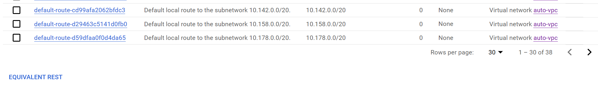

 

2.  - 3 routes
    - 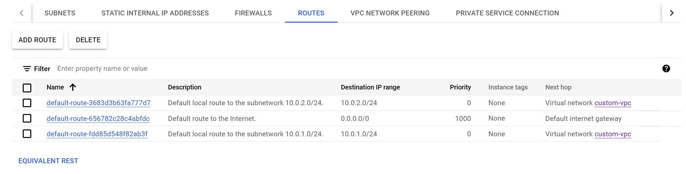
 

3.  - Block the internet access By deleting the 0.0.0.0/0 route
    
 

4.  - .
    - 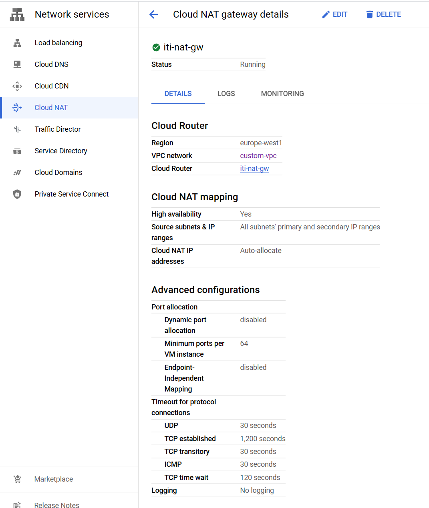

---
## Lab 3.2

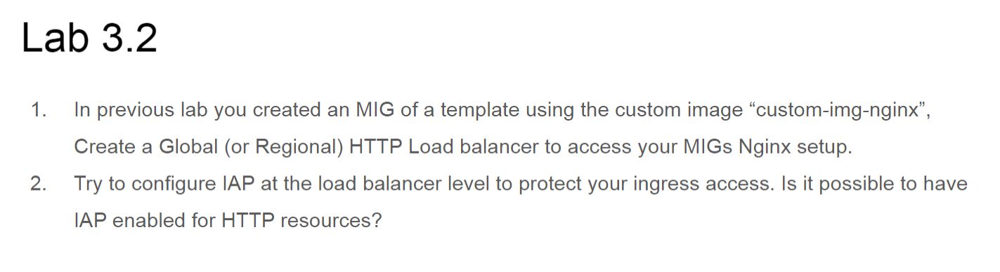

1.  - .
    - 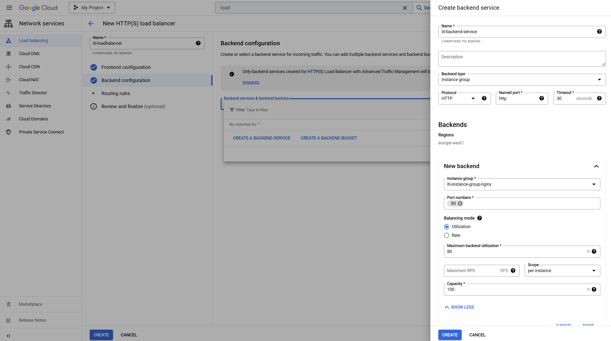
    - 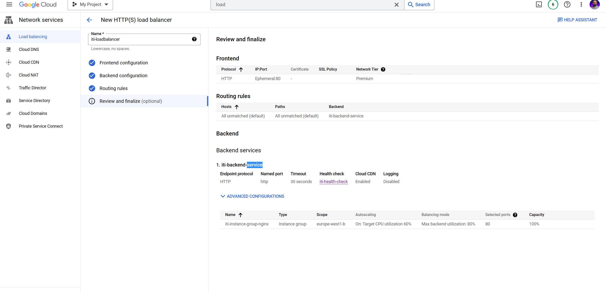
    - 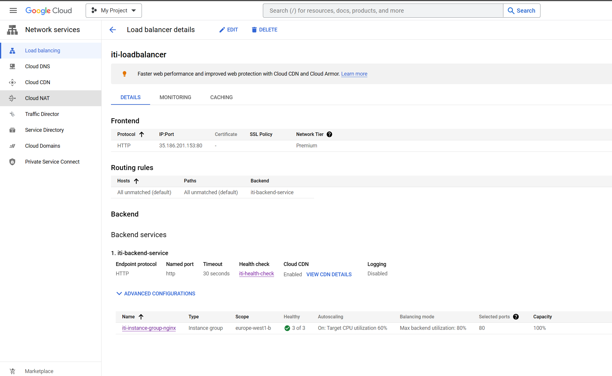
    - 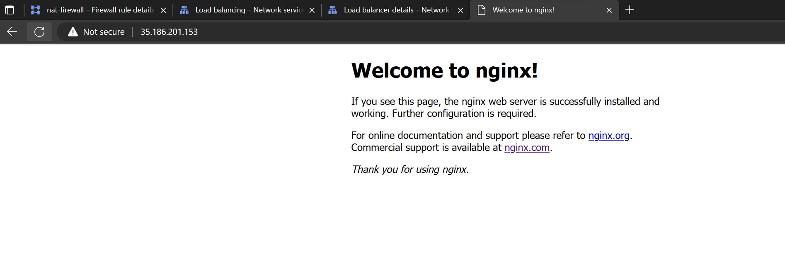

2.  - .
    - 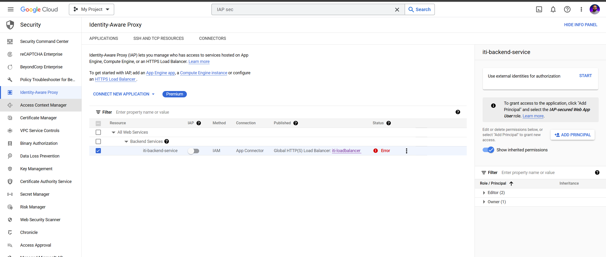

---
## Lab 3.3

1.  - .
    - 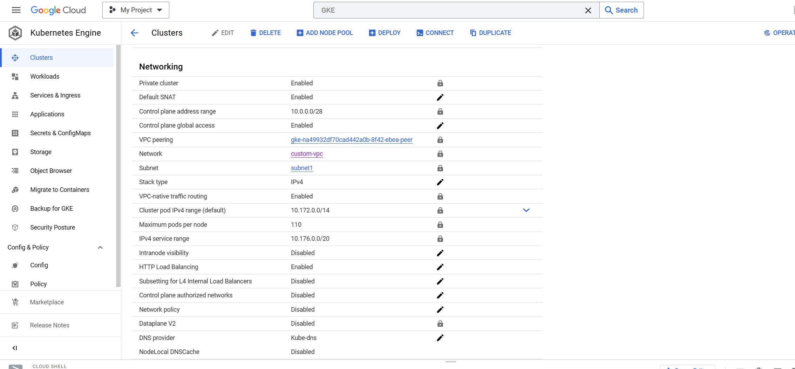
    - 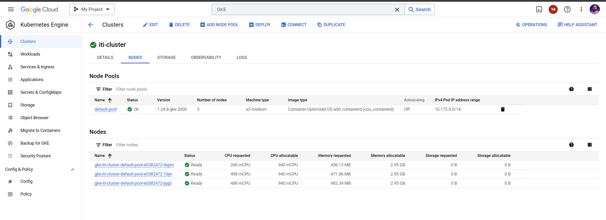

2. and 3
    - .
    - 
    - 

4.  - .
    - 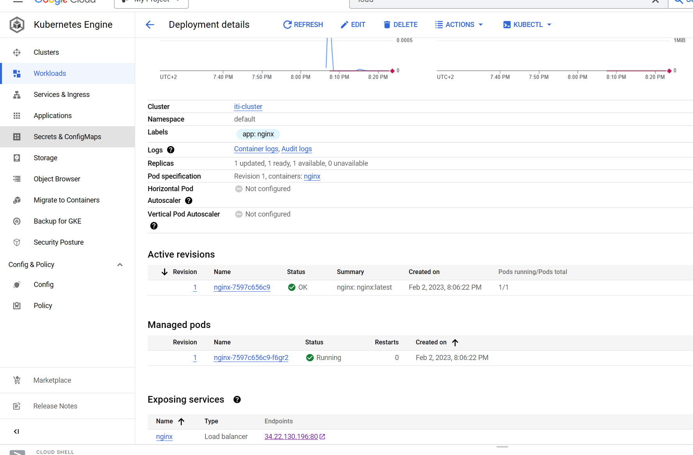
    - 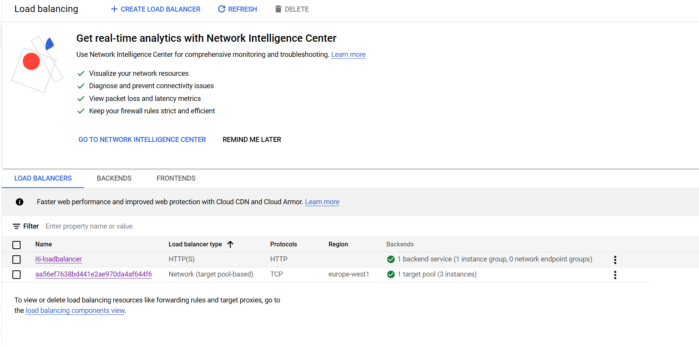

5.  - .
    - 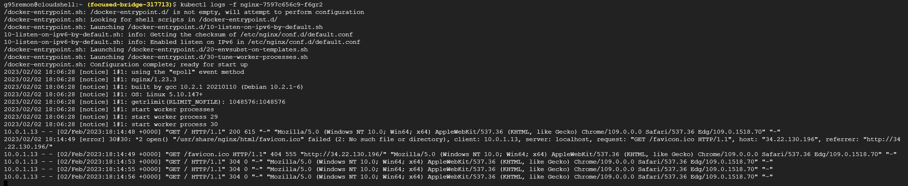

6.  - .
    - 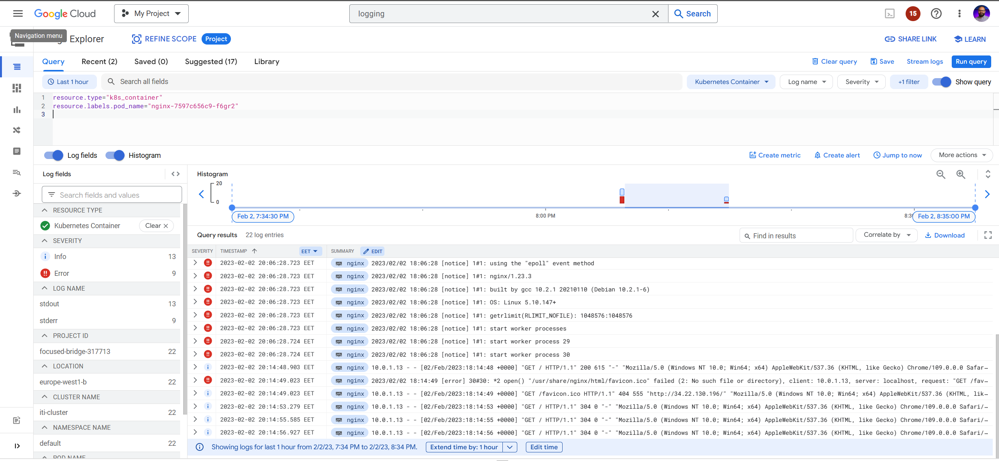

8.  - .
    - 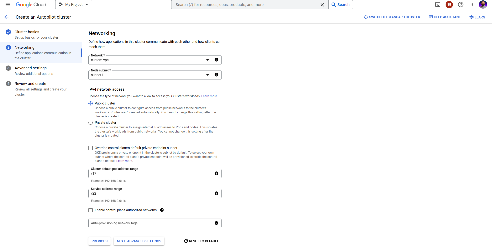
    - 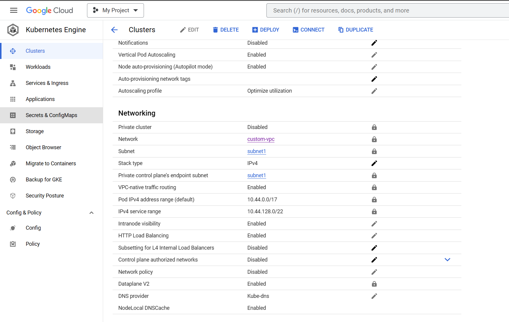

9.  - .
    - 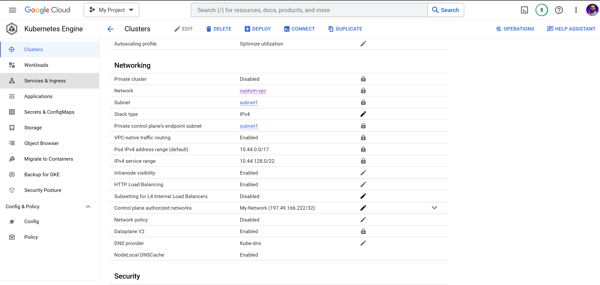
    - 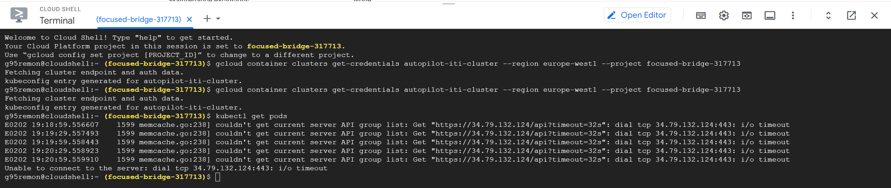

10. - .
    - 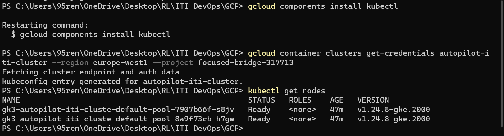