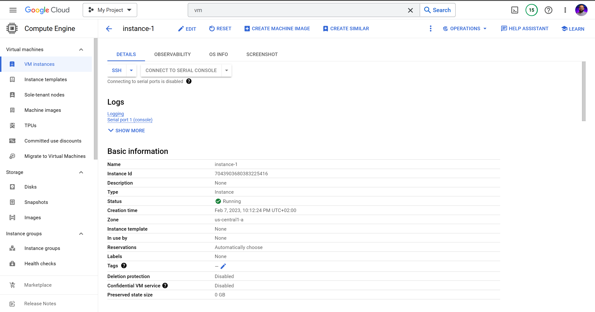
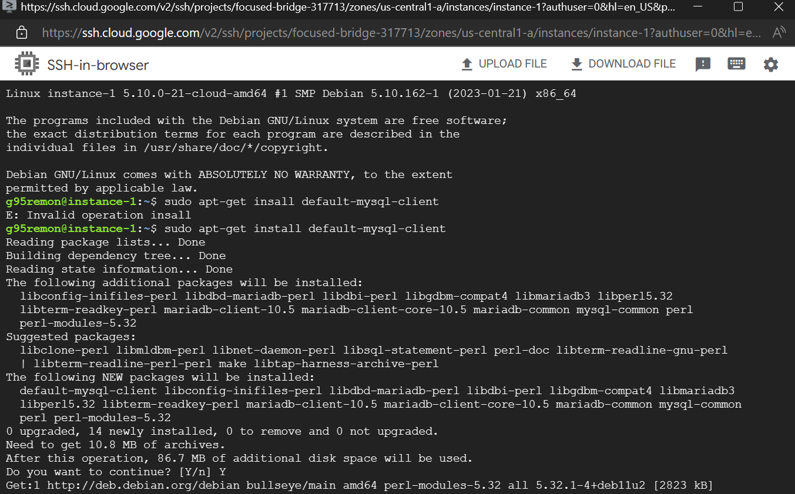
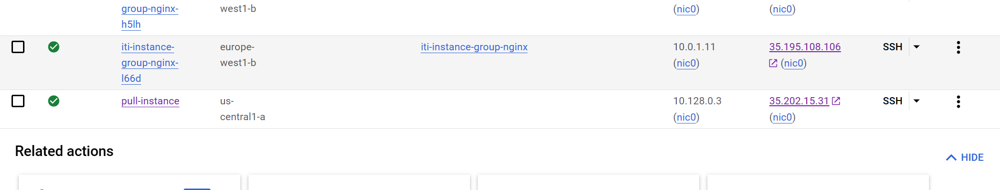

# Day4
## Lab 3.2

1.  - .
    1.  - .
        - 
        - 

     

    2.  - .
        - 

     

    3.  - .
        - 
        - 

     

    4.  - .
        - 
        - 

 

2.  - .
    - 
    - 
    - 
    - 
    - 
    - 
    - 
    - 

 

3.  - .
    - 
    - 
    - 
    - 

 

---

 

## Lab 3.3

1.  - .
    1.  - .
        - 

     

    2.  - .
        - 
        - 
        - 

     

    3.  - .
        - 
        - 
        - 

 

2.  - .
    - 
    - 
    - 
    - 

 

3.  - .
    1.  - .
        - 
        - 
        - 
        - 

     

    2.  - .
        - 
        - 
        - 
        - 
        - 

 

4.  - .
    - 
    - 
